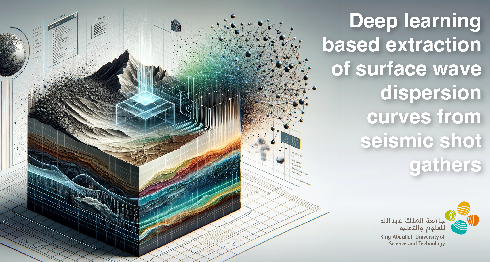

Reproducible material for **Deep learning based extraction of surface wave dispersion curves from seismic shot gathers -
Chamorro D., Zhao J., Birnie C., Staring M., Fliedner M., Ravasi M.** submitted to Near Surface Geophysics.

## Project structure
This repository is organized as follows:

* :file_folder: **data**: folder containing data used for training/testing
    * :open_file_folder: **testing**: folder containing synthetic data generated for testing
    * :open_file_folder: **training**: folder containing synthetic data generated for training
* :open_file_folder: **notebooks**: set of jupyter notebooks reproducing the experiments in the paper as well as the two models trained (see below for more details);

## Notebooks
The following notebooks are provided:

- :orange_book: ``1_dataset_generation.ipynb``: notebook used to generate the training dataset
- :orange_book: ``2_training.ipynb``: notebook performing the training of the network
- :orange_book: ``3_inferencing.ipynb``: notebook performing the inference on real and synthetic dataset
- :orange_book: ``4_uq_analysis.ipynb``: notebook performing the UQ using dropout and statistical parameters estimation methods
- :orange_book: ``5_inversion.ipynb``: notebook to perform inversion using evolutionary algorithms

**Disclaimer:** All experiments have been carried on a Intel(R) Xeon(R) CPU @ 2.10GHz equipped with a single NVIDIA GEForce RTX 3090 GPU. Different environment configurations may be required for different combinations of workstation and GPU.
